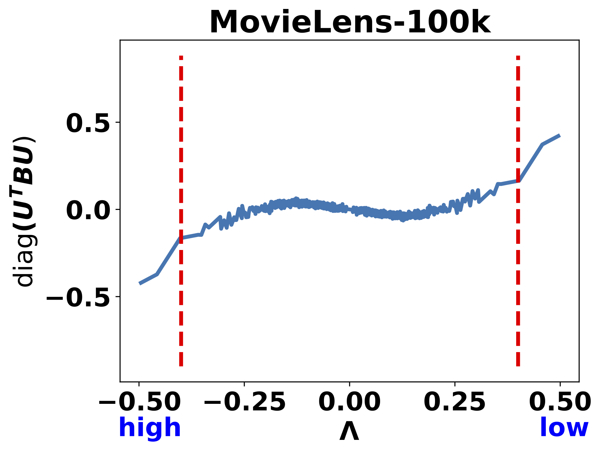
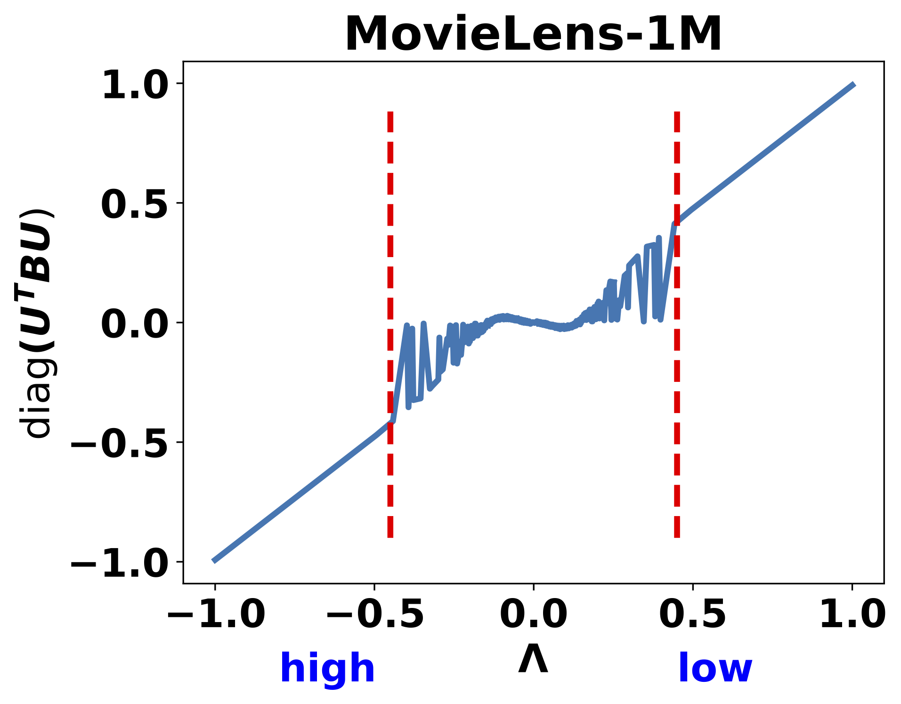
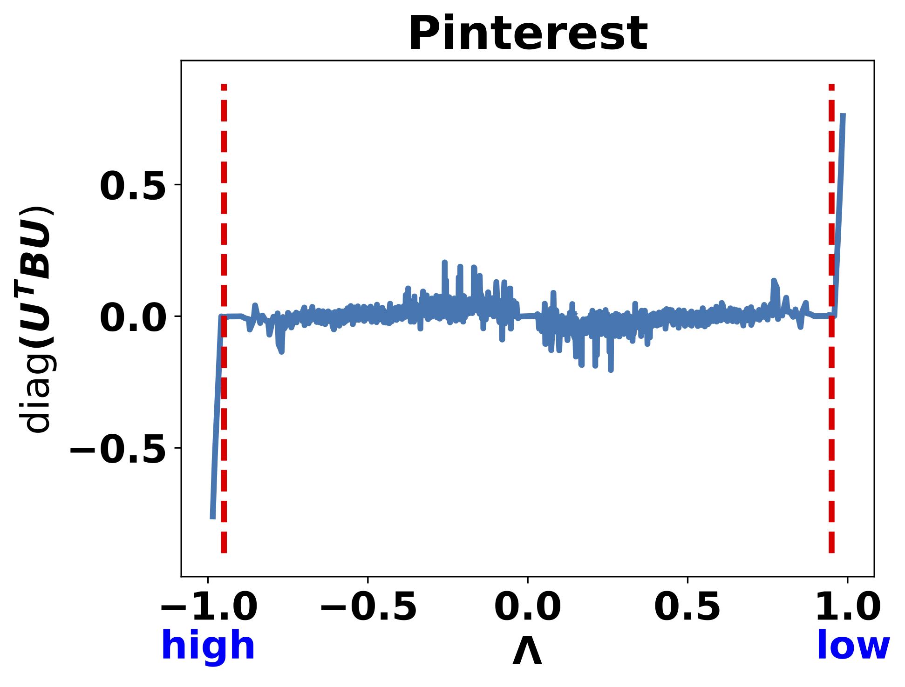

# JGCF
A simple, efficient and effective Jacobi polynomial-based graph collaborative filtering algorithm built on recbole

## Requirements

```
conda env create -f environment.yaml
```

## Quich Start
```
python run.py --dataset gowalla
```

## Datasets

For large scale datasets, you need to downlowd tha dataset to use.

### For Amazon_Books

For alibaba, you can download Amazon_Books.zip from [Google Drive](https://drive.google.com/file/d/1BM27i1EZ_8QZeR-MERLNxFd7LZ8MgyBe/view?usp=share_link). Then
```
mkdir dataset/Amazon_Books
mv Amazon_Books.zip dataset/Amazon_Books
unzip Amazon_Books.zip
python run.py --dataset Amazon_Books
```


### For Alibaba-iFashion

For alibaba, you can download alibaba.zip from [Google Drive](https://drive.google.com/file/d/1wzxGEh0wFq7AghjY8uBEWrGkqNwhVDjc/view?usp=share_link). Then
```
mv alibaba.zip dataset
unzip alibaba.zip
python run.py --dataset alibaba
```

## Empirical Experiments on More Datasets without Sampling





